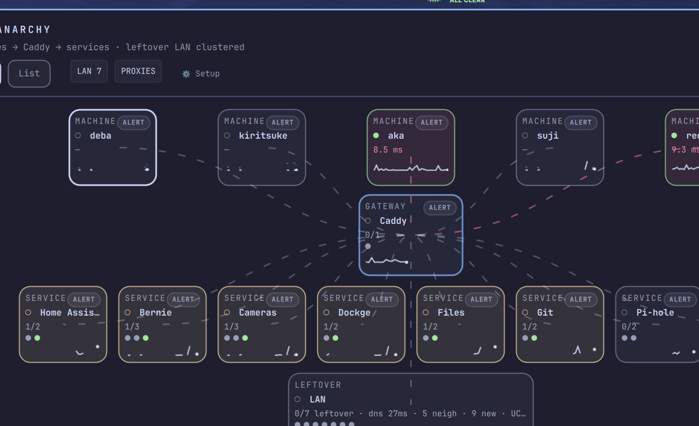
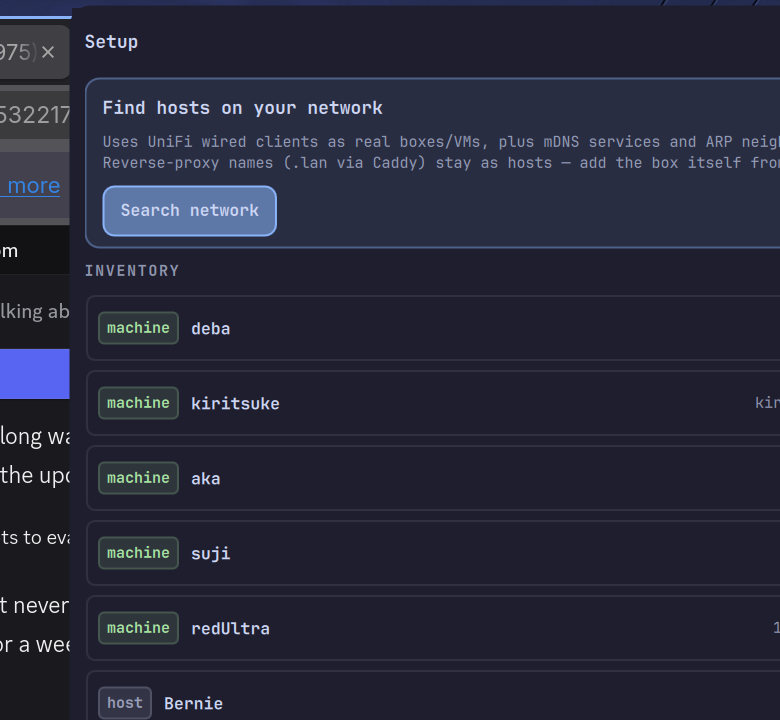

<div align="center">



# OmarPlugs

**Omarchy Quickshell plugins for a real homelab — not a bot farm.**

</div>

---

## Plugins

### [Lanarchy](homelab-mesh/) (`donnie.homelab-mesh`)

Homelab status in the Omarchy bar: machines, Caddy-fronted services, UniFi, and **Search network** so you are not typing IPs.

| | |
|---|---|
| **List** | Pulse-style colour lights for machines / UniFi / service groups |
| **Map** | Letterbox topology — machines → hub → services + leftover LAN |
| **Setup** | Find hosts (UniFi wired boxes + mDNS + ARP), then + add |

<div align="center">


</div>

**Docs:** [homelab-mesh/README.md](homelab-mesh/README.md) · [architecture](homelab-mesh/docs/architecture.md) · [changelog](homelab-mesh/CHANGELOG.md)

**Quick install (dev symlink):**

```bash
ln -sfn /path/to/OmarPlugs/homelab-mesh ~/.config/omarchy/plugins/homelab-mesh
omarchy-shell shell rescanPlugins
omarchy plugin enable donnie.homelab-mesh
omarchy-shell shell summon donnie.homelab-mesh
```

Optional UniFi key: copy `homelab-mesh/unifi-secrets.json.example` → `~/.config/omarchy/plugins/homelab-mesh/unifi-secrets.json`.

---

## Layout

```
OmarPlugs/
├── README.md                 ← you are here
├── homelab-mesh/             ← Lanarchy plugin (manifest + Panel.qml + collectors)
│   ├── README.md             ← full Install / Usage / Remove / IPC
│   ├── preview.png
│   ├── docs/screenshots/
│   └── …
└── scratch/                  ← experiments (not installed)
```

Each plugin is a folder with its own `manifest.json`. Symlink or copy that folder into `~/.config/omarchy/plugins/<id>/`.

---

## Requirements

- [Omarchy](https://omarchy.org) with Quickshell
- Python 3 (Lanarchy collectors)
- Plugins run **unsandboxed** in `omarchy-shell` — only enable code you trust

Validate:

```bash
omarchy plugin validate ./homelab-mesh
```

---

## License

Lanarchy is MIT — see [homelab-mesh/LICENSE](homelab-mesh/LICENSE).
