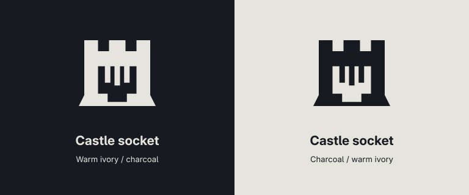

# Lanarchy (`donnie.homelab-mesh`)

Homelab status in the Omarchy bar: who is up, what services sit behind Caddy, and what just appeared on the LAN — without making you type IPs.

Plugin id: `donnie.homelab-mesh`  
Config: `~/.config/omarchy/plugins/homelab-mesh/`  
Repo: [DonnieFi/OmarPlugs](https://github.com/DonnieFi/OmarPlugs)

Deeper sidecar formats (history, notify, edges): [`docs/architecture.md`](docs/architecture.md).

---

## Screenshots

### List dash (default)

Compact colour-light rows for machines, UniFi, and grouped services. Toggle **LAN** / **PROXIES** when you want the noisy leftovers.


### Map (letterbox)

Machines → Caddy hub → services, with a leftover LAN cluster. Borders and status fills follow the active Omarchy theme (`colors.toml` green / yellow / red + accent).


### Setup — Find hosts

Primary onboarding: **Search network**, then click **+ add**. Manual “Add node” is the escape hatch, not the happy path.


### Bar mark

Castle-socket glyph on the Omarchy bar (dark / light variants under `assets/castle-socket/`).



---

## How it works (flow)

```text
inventory.json  ──►  daemon.py (15s)  ──►  probe.py
                                              │
                    ┌─────────────────────────┼─────────────────────────┐
                    ▼                         ▼                         ▼
              ICMP / SSH               UniFi OS API              mDNS + ARP
              machines/hosts           devices + clients         discover[]
                    │                         │                         │
                    └────────────► snapshot.json ◄──────────────────────┘
                                         │
                         Panel.qml (FileView) + notify-state
```

1. **Inventory** (`inventory.json`) is the source of truth — machines you SSH to, `.lan` hosts behind Caddy, TCP/HTTP proxies.
2. **Daemon** holds a flock and runs `probe.py` on an interval; one-shot `probe.py` works the same for debugging.
3. **Probe** builds glance bands (`machines`, `lan`, `proxies`, `groups`, `lan_meta`, `unifi`, `discover`), appends history sparklines, and may fire desktop notifications.
4. **Panel** watches `snapshot.json`. List/Map are read-only views; Setup writes inventory via `inventory_cli.py` (empty writes refused).

Nothing is auto-added to inventory. Discover is candidates only until you click **+ add**.

### Mental model for a typical lab

| Thing | Example | Inventory type | How Lanarchy sees it |
|-------|---------|----------------|----------------------|
| Real box / VM | `yanagiba` @ `.92`, `homeassistant` @ `.178` | `machine` | UniFi wired client, or mDNS `_ssh` / `_workstation` |
| Reverse-proxy name | `ha.lan`, `git.lan` → Caddy on yanagiba | `host` | DNS/ICMP to the name (often the proxy IP) |
| Health check | `https://caddy.lan/health` | `proxy` | HTTP 2xx/3xx or TCP connect |
| Noise | phones, cams, TVs | — | Filtered out of UniFi “Search network” |

So: keep `ha.lan` as a **host** (the front door). Add **homeassistant** as a **machine** when you want the Pi itself. Same story for yanagiba vs every `*.lan` that Caddy terminates.

---

## What “Search network” does

Setup → **Find hosts on your network** → **Search network**.

That button refreshes the live probe and rebuilds `snapshot.discover[]` from three sources, then merges them:

| Source | What it is | Becomes |
|--------|------------|---------|
| **UniFi** | Wired clients from your Cloud Gateway / UDM (API key) | Prefer **`machine`**. Names cleaned (`homeassistant be:b6` → `homeassistant`). Phones / cams / TVs / Chromecast-class noise dropped. |
| **mDNS** | `avahi-browse` services (`_ssh`, `_home-assistant`, …) | `machine` or `host` from service type |
| **ARP neigh** | `ip neigh` entries with a MAC | `host` fallback when nothing else named the IP |

Merge rules:

- Inventory ids / dns / labels / static ips / macs are **known** → hidden from the list.
- History MAC/IP counts only for **`machine`** nodes (so reverse-proxied hosts do not hide yanagiba under Caddy’s IP).
- UniFi wired machines win over mDNS/neigh for the same device.
- Results sort **machines first**, then alpha.

Adding a UniFi machine prefers a `.lan` DNS guess (`yanagiba.lan`) plus the real IP/MAC — homelabbers usually already have internal DNS; you should not need to type `192.168…`.

Without UniFi secrets, Search still runs mDNS + ARP; you just get weaker names.

---

## Icons, pills, and chrome

| Affordance | Meaning |
|------------|---------|
| **Castle-socket** (bar + header) | Lanarchy mark. Alarms when glance has downs. |
| **● / ○** status glyph | Filled = up/down known; hollow = unknown / probing / no data. |
| **Green / yellow / red** | Theme `colors.toml` (`green`, `yellow`, `red`) — up / degraded / down. Accent for hub & selected chrome. |
| **LIVE · ALL CLEAR / …** header pill | Aggregate glance health + `as_of` clock. |
| **Map / List** tab pills | View switch (`m` / `l`). |
| **LAN N / PROXIES** | Show leftover hosts / proxies not folded into a service group. |
| **⚙ Setup** | Inventory editor (`s`). |
| **ALERT / MUTE** on map cards | Per-node notify arm. Enter toggles selection; click the chip. |
| **Sparklines** | Recent RTT from `history.json` (via `history_cli.py`). |
| **machine / host / proxy** chips (Setup) | Inventory type. Green border = machine. |
| **unifi · box / mdns / arp** chips | Discover source on Found rows. |
| **Member light dots** on service cards | Per-member up/down inside a group (HA, Pi-hole, …). |

Keyboard (glance): `r` refresh · `m`/`l` map/list · `n` LAN leftovers · `p` proxies · `s` setup · arrows select on map · Enter notify.

---

## Enable

```bash
# symlink or copy this folder
ln -sfn /path/to/OmarPlugs/homelab-mesh ~/.config/omarchy/plugins/homelab-mesh

omarchy-shell shell rescanPlugins
omarchy-plugin-enable donnie.homelab-mesh
omarchy-shell shell summon donnie.homelab-mesh
```

Edit `~/.config/omarchy/plugins/homelab-mesh/inventory.json` (or use Setup).

---

## UniFi

Local Cloud Gateway / UDM at `settings.unifi.url` (default `https://192.168.1.1`).

- `/api/system` needs no key → enough for the UNIFI list row (name, model).
- Clients / APs / Search-network machine names need a Network API key:

```bash
cp unifi-secrets.json.example ~/.config/omarchy/plugins/homelab-mesh/unifi-secrets.json
# UNIFI_KEY=...   (or JSON {"apiKey":"..."})
```

`unifi-secrets.json` is gitignored. Never put the key in inventory.

---

## Commands

| Script | Role |
|--------|------|
| `daemon.py` | Singleton collector; writes `snapshot.json` ~every 15s |
| `probe.py` | One-shot glance; also `wol <id\|mac>` and `speedtest [--id <machine>]` |
| `inventory_cli.py` | `dump` / `migrate` / `write` (refuses empty `nodes`) |
| `history_cli.py` | `sparkline --id <node>` for map cards |

Optional speedtest URL: `settings.speedtestUrl`. Curl first; `iperf3` only if already installed — never a hard dependency.

---

## Notifications

- Fail-streak: node must be `down` N times (`settings.failStreakThreshold`, default 3). `unknown` (DNS miss, etc.) does **not** reset or advance the streak.
- Unknown neighbor: new ARP lladdr not matching inventory / machine history → one notify per MAC until muted (`settings.unknownNeighborNotify`).

---

## Tests

```bash
cd ~/.config/omarchy/plugins/homelab-mesh   # or the repo copy
for t in test_*.py; do python3 "$t"; done
```
